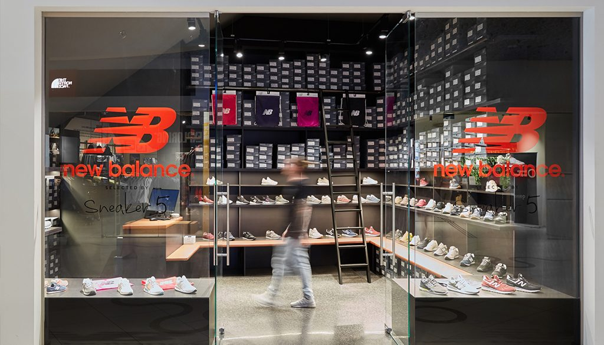
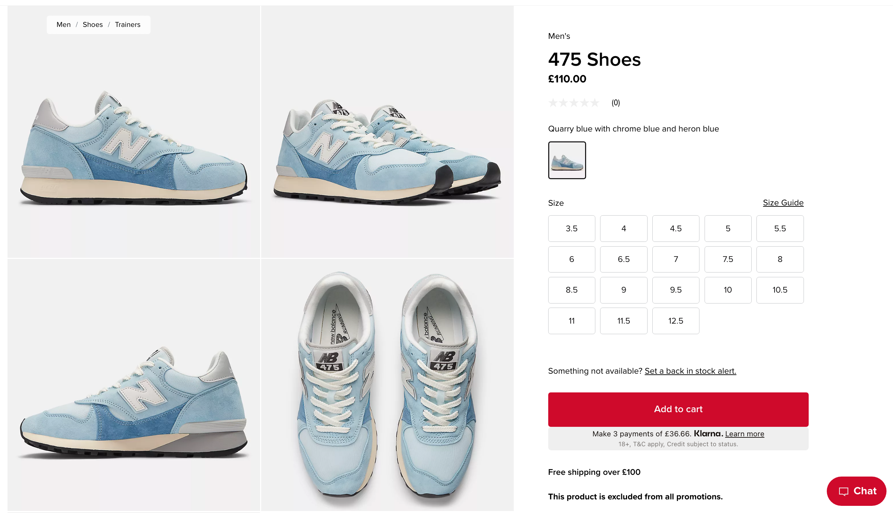
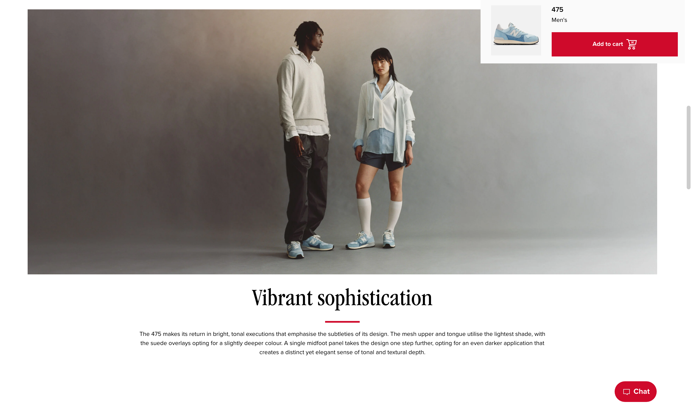

# New Balance Website A/B Testing

## Table of Contents:
1. [Project Background](#project-background)
2. [Data Visualizations](#data-visualizations)
3. [A/B Testing](#ab-testing)
4. [Executive Summary](#executive-summary)
5. [Recommendations](#recommendations)

# Project Background
[Back to Table of Contents](#table-of-contents)

New Balance, a globally recognized leader in athletic footwear and apparel, is navigating the challenge of optimizing its ecommerce platform to drive higher conversion rates. As the company prepares to launch a new line of shoes, the 475 series, ensuring the product pages perform effectively in converting visitors into customers is critical. In a highly competitive market where online user experience directly impacts sales, New Balance must fine-tune its ecommerce strategies to capitalize on the 475 line’s potential.

An A/B test was conducted on the product page for the 475 shoes to assess the impact of a webpage redesign. The original page served as the control, while the redesigned version incorporated minimalist visuals, improved marketing copy, and a focus on models over the actual shoe. The core business problem: Does the new webpage significantly increase purchase conversions compared to the old version, ensuring the success of the 475 line’s launch?

To answer this, three statistical methods were used—sample distribution analysis, z-tests, and and logistic regression—to rigorously evaluate the impact of the new design. The results of this analysis aims to provide data-driven recommendations that will help New Balance maximize the 475 line’s sales performance and inform future optimizations of the ecommerce platform, ultimately driving online sales growth through increased purchase conversions.

The original product page design (A).

The new product page design (B).

*Disclaimer: The dataset used in this project is a realistic sample created to simulate New Balance ecommerce data and does not represent actual product information.*

# Data Visualizations
[Back to Table of Contents](#table-of-contents)

# A/B Testing
[Back to Table of Contents](#table-of-contents)

# Executive Summary
[Back to Table of Contents](#table-of-contents)

# Recommendations
[Back to Table of Contents](#table-of-contents)
