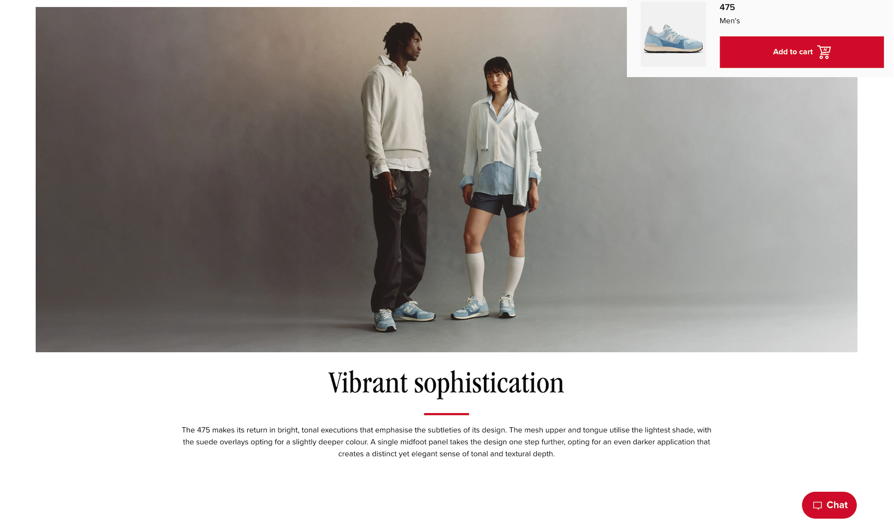
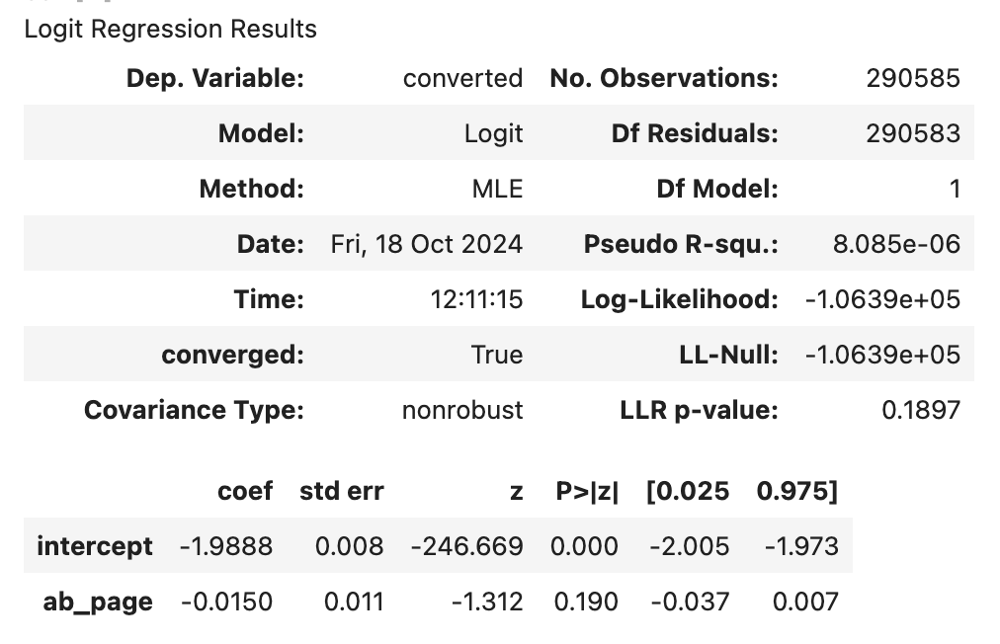

# New Balance Website A/B Testing

## Table of Contents:
1. [Project Background](#project-background)
2. [Data Visualizations](#data-visualizations)
3. [A/B Testing](#ab-testing)
4. [Executive Summary](#executive-summary)
5. [Recommendations](#recommendations)

# Project Background
[Back to Table of Contents](#table-of-contents)

New Balance, a globally recognized leader in athletic footwear and apparel, is navigating the challenge of optimizing its ecommerce platform to drive higher conversion rates. As the company prepares to launch a new line of shoes, the 475 series, ensuring the product pages perform effectively in converting visitors into customers is critical. In a highly competitive market where online user experience directly impacts sales, New Balance must fine-tune its ecommerce strategies to capitalize on the 475 line’s potential.

An A/B test was conducted on the product page for the 475 shoes to assess the impact of a webpage redesign. The original page served as the control, while the redesigned version incorporated minimalist visuals, improved marketing copy, and a focus on models over the actual shoe. The core business problem: Does the new webpage significantly increase purchase conversions compared to the old version, ensuring the success of the 475 line’s launch?

To answer this, statistical methods were used—z-tests and logistic regression—to rigorously evaluate the impact of the new design. The results of this analysis aims to provide data-driven recommendations that will help New Balance maximize the 475 line’s sales performance and inform future optimizations of the ecommerce platform, ultimately driving online sales growth through increased purchase conversions.

The original product page design (A).

The new product page design (B).

*Disclaimer: The dataset used in this project is a realistic sample created to simulate New Balance ecommerce data and does not represent actual product information.*

# Data Visualizations
[Back to Table of Contents](#table-of-contents)

The data visualization above was created in Tableau. The full interactive dashboard can be found [here](tableau/nb_dashboard.twb).

Several insights were uncovered after analyzing the data:
1. The probability that an individual received the new page is 50%.
2. The probability of an individual converting to a paying customer regardless of the page they receive is 11.96%.
3. Given that an individual was in the control group, the probability they converted to a paying customer is 12.04%.
4. Given that an individual was in the treatment group, the probability they converted to a paying customer is 11.88%.

At first glance, it appears that there is no significant difference in the conversion rates between treatment and control groups. The following section will look to reconcile this with statistical analysis.

# A/B Testing
[Back to Table of Contents](#table-of-contents)

To evaluate the effectiveness of New Balance's new product page design, a comprehensive A/B testing approach was implemented. The deciding metric was defined as customer conversion or whether the individual completed a shoe purchase.

The entire A/B test was conducted in python. The full notebook and code can be found [here](python/ecom_a_b_test.ipynb).

**Hypothesis Testing Framework:**

A two-tailed hypothesis test was constructed with the null hypothesis (H₀) positing that there was no significant difference between the conversion rates between the two product pages, while the alternative hypothesis suggests that there is a statistical significance.
- H₀: P(old) - P(new) ≥ 0
- H₁: P(old) - P(new) < 0

**Statistical Analysis:**

Given the large sample size of approximately 300,000 observations, the central limit theorem justified the use of a z-test for statistical inference. The analysis yielded a z-score of -1.310 and a corresponding p-value of 0.905. This p-value, being substantially larger than the predetermined significance level of 0.05, means that we fail to reject the null hypothesis.

**Machine Learning Model:**

To further validate the findings, a logistic regression model was employed to test for significant differences in conversion rates between the control and treatment groups. This more sophisticated approach accounted for the binary nature of the conversion metric. 

The logistic regression analysis produced a p-value of 0.19, which again exceeded the 0.05 significance threshold, corroborating the initial finding of failing to reject the null hypothesis.

Results Interpretation
The statistical evidence consistently indicates that the new page design did not demonstrate a significant improvement in conversion rates compared to the original design. The high p-values across multiple statistical approaches (0.9 from the initial analysis and 0.19 from logistic regression) strongly suggest that any observed differences in conversion rates between the two page versions were likely due to random chance rather than a genuine effect of the design changes.
This rigorous statistical analysis provides actionable insights for New Balance's e-commerce strategy, suggesting that additional iterations or alternative approaches may be necessary to achieve significant improvements in conversion rates.

# Executive Summary
[Back to Table of Contents](#table-of-contents)

An extensive A/B test was conducted to evaluate the effectiveness of the 475 new product page design in improving customer conversion rates. The experiment analyzed approximately 300,000 user interactions across both the old and new product pages, providing a robust dataset for statistical analysis.

1. **Key Findings:** No statistically significant improvement in conversion rates was observed with the new page design. This is supported by multiple statistical approaches, including z-test and logistic regression. Any observed differences in conversion rates between the old and new designs can be attributed to random variation rather than actual performance improvements.

2. **Business Implications:** The current redesign initiative has not demonstrated the anticipated positive impact on sales performance. The investment in implementing the new page design may not justify the expected returns.

# Recommendations
[Back to Table of Contents](#table-of-contents)

Based on the uncovered insights, the following recommendations have been provided:

1. **Retain Current Design Implementation:** Maintain the existing product page design for the 475 line given the lack of significant improvement in conversion rates. Continue monitoring baseline conversion metrics to establish stronger seasonal and temporal patterns. There is still the question of whether this experiment ran long enough to pose significant results. Would the results change over a longer period of time?
2. **Granular Testing Strategy:** Implement smaller, focused A/B tests on individual page elements rather than full-page redesigns. This will not only cost less resources, but will allow for answers to more precise questions: How does product image placement and size affect conversion? What about the buy button positioning and design? The price display formatting? Changing these small elements will lead to better, cleaner data.
3. **Enhanced Data Collection**: Tracking more robust user data besides conversion rate would be immensely beneficial, especially for developing predicting models. For example, this could include implementing heat mapping and scroll depth tracking to understand user interaction patterns, setting up funnel analysis to identify specific points of user drop-off, or collecting qualitative user feedback through targeted surveys. 
4. **Benchmarking Analysis:** New Balance has a wealth of data on previous product launches. Comparing the 475s with a comparable product's (such as the 574 line) product page conversion rates would be effective for benchmarking the 475s performance. If there is a statistically significant difference between their sales results, it will be worth investigating why one line is more successful than the other. What factors were most responsible for online sales growth and are those factors replicable?
